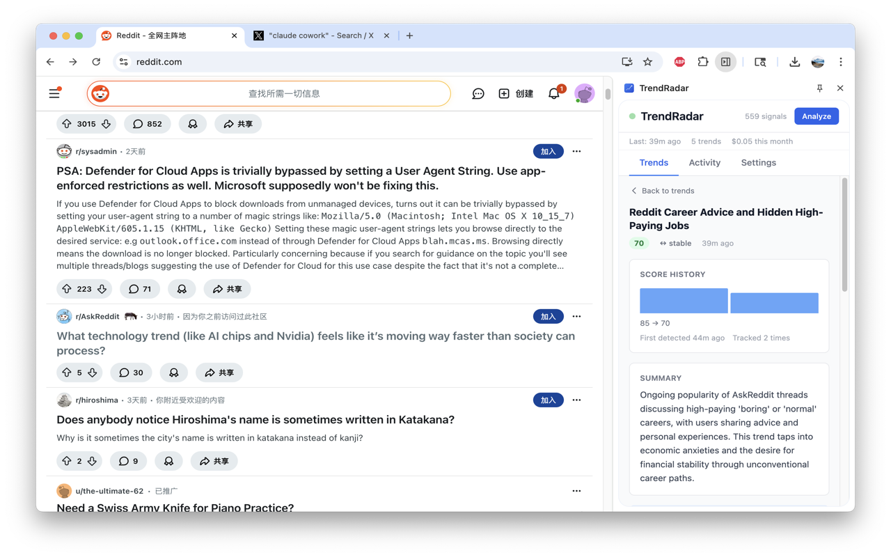
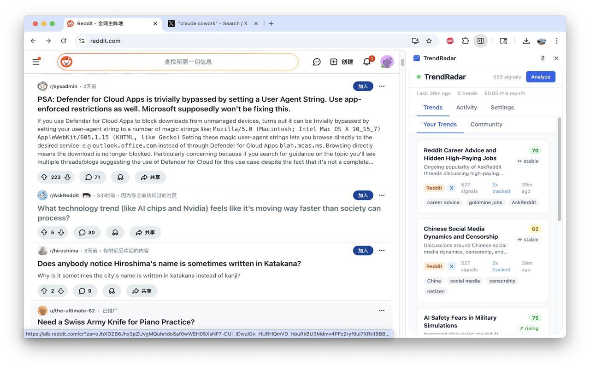
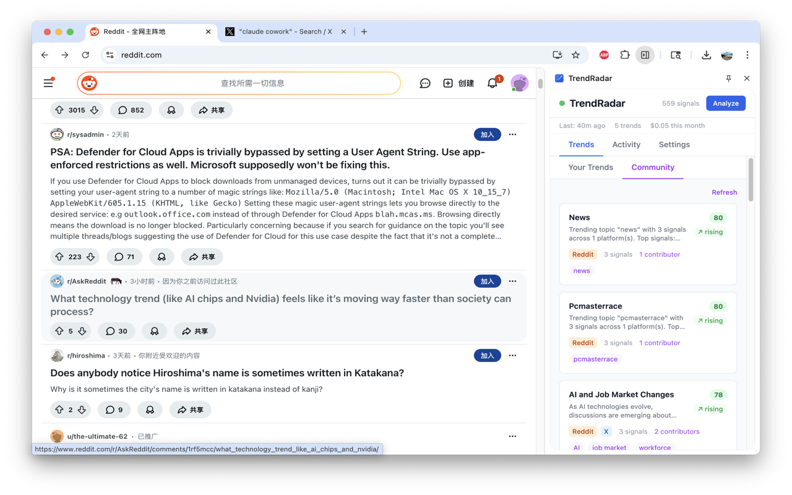
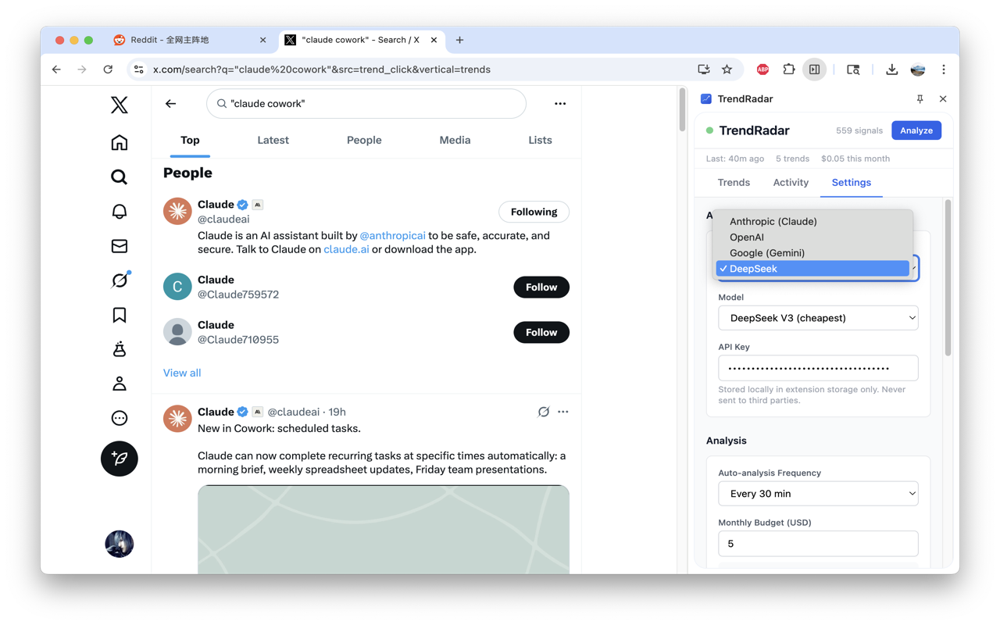

# TrendRadar

**Spot emerging trends before they go mainstream.**

TrendRadar is a Chrome extension for content creators. It captures public content signals from Reddit and X as you browse, stores everything locally, and uses AI to surface rising topics and cross-platform momentum.

<!-- Update the link below once the extension is published -->
<!-- [Install from Chrome Web Store](https://chrome.google.com/webstore/detail/trendradar/EXTENSION_ID) -->

---

## How It Works

1. **Browse normally** — TrendRadar runs in the background as you visit Reddit and X
2. **Signals are captured** — post titles, engagement metrics, timestamps, all stored locally on your device
3. **AI analyzes patterns** — choose your preferred provider, use your own API key, and discover what's rising
4. **View trends** — a side panel dashboard shows emerging topics, momentum scores, and cross-platform insights

## Features

### Trend Dashboard

Discover emerging topics with momentum scores, keyword tags, and cross-platform signals at a glance.

### Activity Feed

See all captured signals in real time — filtered by platform, with engagement metrics and timestamps.

### Community Trends

Optionally see anonymized aggregate trends from other TrendRadar users.

### Multi-Provider AI Settings

Choose from Claude, OpenAI, Gemini, or DeepSeek. Bring your own API key — no subscriptions, no hidden costs.

---

## Supported AI Providers

| Provider | Available Models |
|----------|-----------------|
| Anthropic Claude | Claude Sonnet 4, Claude Haiku 4 |
| OpenAI | GPT-4o Mini, GPT-4o |
| Google Gemini | Gemini 2.0 Flash, Gemini 2.0 Flash Lite, Gemini 2.5 Pro |
| DeepSeek | DeepSeek V3, DeepSeek R1 |

API keys are stored locally and never sent to our servers.

## Who Is This For?

- Content creators looking for early topic ideas
- YouTubers and streamers tracking audience interests
- Social media strategists monitoring emerging conversations
- Indie founders exploring content-led growth

## Privacy

- All data stored locally on your device by default
- AI analysis uses your own API keys — we never see your queries or results
- Community features are opt-in and use only anonymized (SHA-256 hashed) data
- No personal information is collected

Read the full [Privacy Policy](PRIVACY_POLICY.md).

## Feedback & Support

Found a bug or have a suggestion? [Open an issue](https://github.com/GavinHarbus/TrendRadarPlugin/issues).
